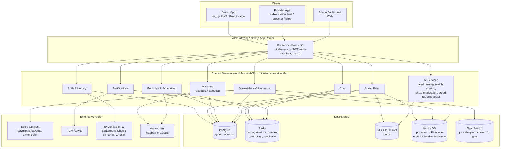
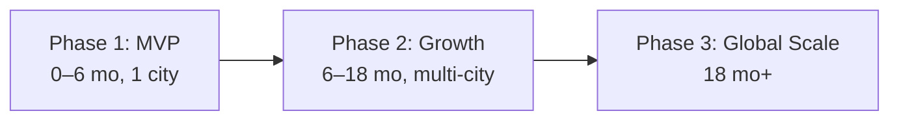

# PETINDER — System Architecture

> Mobile-first platform combining **Rover** (pet services), **Petfinder** (adoption/matching), a **pet social network**, and a **services + products marketplace**.
> MVP: Next.js 15 App Router (TypeScript, Tailwind), JWT auth in httpOnly cookies, in-memory stores. Production: Postgres/Prisma, Redis, S3, managed services. Deploys on Vercel.

---

## 1. High-Level Architecture

**Request path (MVP):** Client → Vercel Edge → `middleware.ts` (JWT in httpOnly cookie, role check) → App Router route handler → in-memory store (MVP) / Prisma → Postgres (prod). WebSocket traffic (chat, notifications, GPS) goes through a managed realtime layer (Pusher) since Vercel functions are not long-lived.

---

## 2. Module Breakdown

### 2.1 User App (Owners)
| Module | Responsibilities |
|---|---|
| Onboarding & auth | Signup/login, JWT issuance, profile basics, location permission |
| Pet profiles | Multi-pet CRUD, photos, breed, vaccination records, temperament tags |
| Discovery | Nearby providers, adoptable pets, geo + filter search |
| Social | Feed, post/like/comment, follow, pet "friends" |
| Matching | Swipe-style playdate matching; adoption matching with shelters |
| Bookings | Book walker/sitter/groomer/vet, live GPS walk tracking, history |
| Marketplace | Product browsing, cart, checkout, order tracking |
| Wallet & payments | Saved cards, wallet credits, receipts, refunds |
| Reviews | Rate providers/products post-completion |

### 2.2 Provider App (Partners)
| Module | Responsibilities |
|---|---|
| Provider onboarding | Business profile, service categories, ID verification, background check, Stripe Connect onboarding |
| Service catalog | Define services, pricing, service radius |
| Availability | Calendar, recurring slots, blackout dates |
| Booking management | Accept/decline, in-progress updates, GPS check-in/out for walks |
| Earnings | Balance, payout schedule, commission breakdown, tax docs |
| Storefront (shops) | Product/inventory management, order fulfillment |
| Reputation | Reviews, response rate, badges (Verified, Top Rated) |

### 2.3 Marketplace
- Multi-vendor catalog (vendors → products → inventory), cart, orders, order items.
- Stripe Connect destination charges with **application fee = platform commission (10–25% by category)**.
- Order lifecycle: `cart → placed → paid → fulfilled → delivered → review window → closed`.
- Search/browse via OpenSearch (facets: category, price, rating, distance for local pickup).

### 2.4 Social Network
- Feed (followed + ranked discovery), posts (photo/video), likes, comments, follows.
- Fan-out-on-write to Redis lists for follower feeds at MVP scale; move to a ranked feed service with a feature store at scale.
- Media pipeline: client → presigned S3 upload → async thumbnail/transcode → CDN.

### 2.5 AI Features
| Feature | Approach |
|---|---|
| Feed ranking | Engagement features in feature store; embedding similarity from vector DB |
| Playdate/adoption matching | Pet embeddings (breed, size, energy, temperament, location) → vector similarity + rule filters |
| Photo moderation | Vision model flags NSFW/non-pet/abuse content pre-publish |
| Breed identification | Image classifier suggests breed on pet profile creation |
| Chat assist | Suggested replies for providers; AI vet-triage disclaimer-gated Q&A |

### 2.6 Trust & Safety
- **Verification ladder:** email → phone → government ID (Persona) → background check (Checkr) for in-home/walk providers. Stored in `verifications`.
- **GPS walk tracking** as a safety feature: route recorded, shared live with owner, retained for dispute evidence.
- **Disputes:** structured flow (open → evidence → resolution: refund/partial/payout hold), Stripe refund integration.
- Content moderation queue (AI-flagged + user reports), audit logs on all admin and money-moving actions.

### 2.7 Admin Dashboard
- User/provider management, verification review queue, content moderation queue.
- Dispute resolution console, refunds, payout holds.
- Marketplace ops: vendor approval, category/commission config.
- Metrics: GMV, take rate, liquidity (fill rate), DAU, NPS.

---

## 3. Tech Stack Recommendation

| Layer | MVP (now) | Scale (Phase 2+) |
|---|---|---|
| Web/mobile client | Next.js 15 App Router PWA (TypeScript, Tailwind) | React Native (Expo) owner + provider apps; Next.js stays for web/admin |
| API | Next.js route handlers, modular monolith | NestJS microservices (auth, bookings, marketplace, feed) behind API gateway; gRPC internal |
| Auth | JWT in httpOnly cookies, custom middleware | Same token model + refresh rotation; OIDC social login; device sessions |
| Database | In-memory stores (MVP demo) → Postgres + Prisma | Postgres (RDS/Aurora) + Prisma; read replicas; partition hot tables (messages, gps_pings, audit_logs) |
| Cache / queues | Redis (Upstash) | Redis cluster; BullMQ → SQS/Kafka for events |
| Realtime | Pusher (managed WebSockets) | Self-hosted Socket.io cluster or Ably; channels for chat, notifications, GPS |
| Payments | Stripe Connect Express, destination charges, 10–25% application fee | Same + Stripe Treasury/Instant Payouts, multi-currency, tax (Stripe Tax) |
| Media | S3 presigned uploads + CloudFront | + on-the-fly image resizing (Lambda@Edge), video transcode pipeline |
| Search | Postgres FTS + PostGIS | OpenSearch (text + geo + facets) |
| AI/ML | pgvector, hosted model APIs | Dedicated vector DB (Pinecone), feature store (Feast) for feed ranking, batch + online inference |
| Observability | Vercel analytics, Sentry | Datadog/Grafana, OpenTelemetry tracing across services |
| Hosting | Vercel | Vercel (web) + AWS (ECS/EKS for services), multi-region |

---

## 4. Rollout Plan

### Phase 1 — MVP (months 0–6, single metro)
- **Features:** auth + 3 roles, pet profiles, basic feed, playdate matching, walker/sitter bookings with manual GPS tracking, Stripe checkout with flat commission, chat (Pusher), reviews, minimal admin.
- **Infra:** Next.js monolith on Vercel, Postgres + Prisma (replace in-memory stores), Upstash Redis, S3, Stripe Connect Express, Persona ID checks.
- **Team:** 2 full-stack, 1 designer, 1 founder/PM, fractional ops for T&S review.

### Phase 2 — Growth (months 6–18, 5–10 cities)
- **Features:** marketplace (products, multi-vendor), adoption matching with shelter partners, ranked feed, provider subscriptions + featured listings, live GPS walk tracking, dispute center, AI photo moderation + breed ID.
- **Infra:** extract bookings + payments into NestJS services, OpenSearch, BullMQ workers, RN/Expo native apps, Checkr background checks, read replicas.
- **Team:** 6–8 engineers (2 squads: marketplace, social/match), 1 data engineer, 2 designers, PM, T&S lead + 2 moderators, city launch ops.

### Phase 3 — Global Scale (18 months+)
- **Features:** multi-currency/multi-language, insurance add-ons, vet telehealth, ads/sponsored content, loyalty/wallet, API for shelter networks.
- **Infra:** full microservices on EKS, Kafka event backbone, feature store + online ranking, multi-region Postgres (Aurora Global), Pinecone, data warehouse (Snowflake) + CDP.
- **Team:** 25–40 engineers across 5–6 squads (payments, marketplace, social, match, trust & safety, platform), ML team, 24/7 T&S ops, regional GMs.

---

## 5. Cross-Cutting Concerns

| Concern | Decision |
|---|---|
| AuthZ | RBAC via JWT claims (`role: owner | provider | admin`) enforced in `middleware.ts`; resource-level ownership checks in handlers |
| Idempotency | `Idempotency-Key` header on all payment/booking mutations |
| Money | All amounts in integer minor units; ledger-style `wallet_transactions`; payouts only from settled funds |
| PII / compliance | PCI scope offloaded to Stripe; PII encrypted at rest; GDPR delete pipeline; minors prohibited |
| Eventing | Domain events (`booking.completed`, `order.paid`) drive notifications, payouts, review prompts |
| Audit | `audit_logs` append-only for admin actions, payouts, verification decisions |
