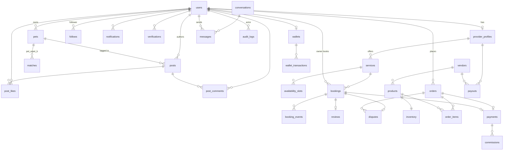

# PETINDER — Database Schema

> Target: **Postgres 16 + Prisma**. MVP runs the same shapes in in-memory stores; this is the production contract.
> Conventions: `id uuid PK (default gen_random_uuid())`, `created_at/updated_at timestamptz`, money as `integer` minor units + `currency char(3)`, soft delete via `deleted_at` where noted. Enums shown inline.

---

## 1. Entity-Relationship Diagram

---

## 2. Identity & Profiles

### users
| Column | Type | Notes |
|---|---|---|
| id | uuid | PK |
| email | citext | UNIQUE, NOT NULL |
| password_hash | text | argon2id |
| role | enum(owner, provider, admin) | default `owner` |
| name | text | |
| avatar_url | text | S3/CDN |
| phone | text | E.164, nullable until verified |
| location | geography(point) | PostGIS; GIST index |
| city, country | text | |
| status | enum(active, suspended, deleted) | |
| created_at / updated_at / deleted_at | timestamptz | |

Indexes: `UNIQUE(email)`, `GIST(location)`, `(role, status)`.

### provider_profiles
| Column | Type | Notes |
|---|---|---|
| id | uuid | PK |
| user_id | uuid | FK → users, UNIQUE |
| business_name | text | |
| provider_type | enum(walker, sitter, vet, groomer, shop) | |
| bio | text | |
| service_radius_km | int | |
| stripe_account_id | text | Stripe Connect Express acct |
| verification_status | enum(unverified, pending, verified, rejected) | |
| background_check_status | enum(none, pending, clear, flagged) | |
| rating_avg | numeric(3,2) | denormalized from reviews |
| rating_count | int | |
| subscription_tier | enum(free, pro, elite) | monetization |
| featured_until | timestamptz | featured-listing expiry |

Indexes: `UNIQUE(user_id)`, `(provider_type, verification_status)`, `(featured_until)`.

### pets
| Column | Type | Notes |
|---|---|---|
| id | uuid | PK |
| owner_id | uuid | FK → users |
| name | text | NOT NULL |
| species | enum(dog, cat, bird, rabbit, reptile, other) | |
| breed | text | AI-suggested, owner-confirmed |
| sex | enum(male, female, unknown) | |
| birth_date | date | |
| size | enum(xs, s, m, l, xl) | |
| energy_level | smallint | 1–5, matching feature |
| temperament_tags | text[] | GIN index |
| photos | jsonb | array of S3 keys |
| vaccinated | boolean | |
| adoptable | boolean | true for shelter listings |
| is_premium | boolean | premium pet profile |
| embedding | vector(768) | pgvector; HNSW index, matching |

Indexes: `(owner_id)`, `GIN(temperament_tags)`, `HNSW(embedding)`, partial `(adoptable) WHERE adoptable`.

---

## 3. Social

### posts
| Column | Type | Notes |
|---|---|---|
| id | uuid | PK |
| author_id | uuid | FK → users |
| pet_id | uuid | FK → pets, nullable |
| body | text | ≤ 2,000 chars |
| media | jsonb | photos/videos (S3 keys, dims) |
| visibility | enum(public, followers) | |
| like_count / comment_count | int | denormalized counters |
| moderation_status | enum(pending, approved, flagged, removed) | AI + human |
| is_sponsored | boolean | ads/sponsored content |
| created_at / deleted_at | timestamptz | |

Indexes: `(author_id, created_at DESC)`, `(moderation_status)`, `(created_at DESC) WHERE visibility='public'`.

### post_likes
`post_id uuid FK→posts` + `user_id uuid FK→users` (composite PK), `created_at timestamptz`. Index `(user_id, created_at)`.

### post_comments
`id uuid PK` · `post_id uuid FK→posts` · `author_id uuid FK→users` · `body text` · `parent_id uuid self-FK (one-level threading)` · `moderation_status enum (as posts)` · `created_at/deleted_at`. Index `(post_id, created_at)`.

### follows
`follower_id` + `followee_id` (both `uuid FK→users`, composite PK), `created_at`. Index `(followee_id)` for follower counts; CHECK `follower_id <> followee_id`.

### matches
| Column | Type | Notes |
|---|---|---|
| id | uuid | PK |
| kind | enum(playdate, adoption) | |
| pet_a_id | uuid | FK → pets (initiator's pet) |
| pet_b_id | uuid | FK → pets (target / adoptable pet) |
| initiator_user_id | uuid | FK → users |
| status | enum(pending, liked, matched, passed, expired, adopted) | |
| score | real | AI compatibility score 0–1 |
| matched_at | timestamptz | |

Indexes: `UNIQUE(kind, pet_a_id, pet_b_id)`, `(initiator_user_id, status)`.

---

## 4. Services & Bookings

### services
| Column | Type | Notes |
|---|---|---|
| id | uuid | PK |
| provider_id | uuid | FK → provider_profiles |
| category | enum(walk, sitting, boarding, grooming, vet_visit, training) | drives commission rate |
| title / description | text | |
| price_amount | int | minor units |
| currency | char(3) | default USD |
| duration_min | int | |
| active | boolean | |

Indexes: `(provider_id, active)`, `(category)`.

### availability_slots
| Column | Type | Notes |
|---|---|---|
| id | uuid | PK |
| service_id | uuid | FK → services |
| starts_at / ends_at | timestamptz | |
| recurrence_rule | text | RFC 5545 RRULE, nullable |
| capacity | smallint | default 1 |
| booked_count | smallint | |

Indexes: `(service_id, starts_at)`; exclusion constraint on overlapping slots per service.

### bookings
| Column | Type | Notes |
|---|---|---|
| id | uuid | PK |
| owner_id | uuid | FK → users |
| provider_id | uuid | FK → provider_profiles |
| service_id | uuid | FK → services |
| pet_id | uuid | FK → pets |
| slot_id | uuid | FK → availability_slots, nullable |
| status | enum(requested, accepted, declined, paid, in_progress, completed, cancelled, disputed) | |
| starts_at / ends_at | timestamptz | |
| price_amount / currency | int / char(3) | snapshot at booking time |
| commission_rate | numeric(4,3) | snapshot, e.g. 0.180 |
| gps_track | jsonb | walk route polyline summary (raw pings in Redis → cold storage) |
| notes | text | |

Indexes: `(owner_id, status)`, `(provider_id, starts_at)`, `(status, starts_at)`.

### booking_events
Append-only state machine log.
| Column | Type | Notes |
|---|---|---|
| id | bigserial | PK |
| booking_id | uuid | FK → bookings |
| event | enum(created, accepted, declined, paid, checked_in, gps_started, gps_ended, completed, cancelled, disputed, refunded) | |
| actor_id | uuid | FK → users, nullable (system) |
| payload | jsonb | e.g. GPS checkpoint, cancellation reason |
| created_at | timestamptz | |

Index `(booking_id, created_at)`.

---

## 5. Chat

### conversations
`id uuid PK` · `kind enum(dm, booking, order, support)` · `booking_id / order_id uuid` nullable context FKs · `participant_ids uuid[]` (GIN index; 2 for dm) · `last_message_at timestamptz` sort key. Indexes: `GIN(participant_ids)`, `(last_message_at DESC)`.

### messages
| Column | Type | Notes |
|---|---|---|
| id | uuid | PK (UUIDv7 for ordering) |
| conversation_id | uuid | FK → conversations |
| sender_id | uuid | FK → users |
| body | text | |
| attachments | jsonb | S3 keys |
| read_by | uuid[] | |
| created_at | timestamptz | |

Index `(conversation_id, created_at DESC)`. Partition by month at scale.

---

## 6. Marketplace

### vendors
`id uuid PK` · `provider_profile_id uuid FK→provider_profiles (shop-type), UNIQUE` · `store_name text` · `stripe_account_id text` · `status enum(pending, approved, suspended)` · `commission_rate numeric(4,3)` per-vendor override (default by category).

### products
| Column | Type | Notes |
|---|---|---|
| id | uuid | PK |
| vendor_id | uuid | FK → vendors |
| title / description | text | |
| category | enum(food, toys, accessories, health, grooming_products) | |
| price_amount / currency | int / char(3) | |
| media | jsonb | |
| status | enum(draft, active, archived) | |
| rating_avg / rating_count | numeric(3,2) / int | |

Indexes: `(vendor_id, status)`, `(category, status)`; mirrored to OpenSearch.

### inventory
`product_id uuid PK, FK→products` · `sku text UNIQUE` · `quantity int CHECK ≥ 0` · `reserved int` held during checkout (15-min TTL job releases) · `restock_at timestamptz` nullable.

### orders
| Column | Type | Notes |
|---|---|---|
| id | uuid | PK |
| buyer_id | uuid | FK → users |
| status | enum(pending, paid, fulfilled, delivered, cancelled, refunded, disputed) | |
| subtotal / shipping / tax / total | int | minor units |
| currency | char(3) | |
| shipping_address | jsonb | |

Indexes: `(buyer_id, created_at DESC)`, `(status)`.

### order_items
| Column | Type | Notes |
|---|---|---|
| id | uuid | PK |
| order_id | uuid | FK → orders |
| product_id | uuid | FK → products |
| vendor_id | uuid | FK → vendors (denormalized for split) |
| quantity | int | |
| unit_price | int | snapshot |
| commission_rate | numeric(4,3) | snapshot |

Index `(order_id)`, `(vendor_id, created_at)`.

---

## 7. Money

### payments
| Column | Type | Notes |
|---|---|---|
| id | uuid | PK |
| payer_id | uuid | FK → users |
| booking_id / order_id | uuid | exactly one set (CHECK) |
| stripe_payment_intent_id | text | UNIQUE |
| amount / currency | int / char(3) | |
| application_fee | int | platform commission |
| status | enum(requires_payment, succeeded, refunded, partially_refunded, failed) | |
| refunded_amount | int | default 0 |

### wallets
`id uuid PK` · `user_id uuid FK→users, UNIQUE` · `balance int` (derived; must equal Σ wallet_transactions, reconciled nightly) · `currency char(3)`.

### wallet_transactions
Append-only ledger.
| Column | Type | Notes |
|---|---|---|
| id | bigserial | PK |
| wallet_id | uuid | FK → wallets |
| kind | enum(credit, debit, refund_credit, promo, payout_reversal) | |
| amount | int | signed |
| reference_type / reference_id | text / uuid | payment, booking, order |
| balance_after | int | |
| created_at | timestamptz | |

Index `(wallet_id, created_at)`. No UPDATE/DELETE (trigger-enforced).

### payouts
| Column | Type | Notes |
|---|---|---|
| id | uuid | PK |
| recipient_type | enum(provider, vendor) | |
| recipient_id | uuid | provider_profiles or vendors |
| stripe_transfer_id | text | UNIQUE |
| amount / currency | int / char(3) | |
| status | enum(scheduled, paid, failed, held) | held during disputes |
| period_start / period_end | date | |

### commissions
| Column | Type | Notes |
|---|---|---|
| id | uuid | PK |
| payment_id | uuid | FK → payments |
| booking_id / order_item_id | uuid | nullable source ref |
| category | text | service or product category |
| rate | numeric(4,3) | 0.10–0.25 |
| amount | int | platform revenue |

Index `(payment_id)`, `(category, created_at)` for revenue reporting.

---

## 8. Trust, Safety & Ops

### reviews
| Column | Type | Notes |
|---|---|---|
| id | uuid | PK |
| booking_id / order_item_id | uuid | exactly one set; UNIQUE per source |
| reviewer_id | uuid | FK → users |
| subject_type / subject_id | enum(provider, product) / uuid | |
| rating | smallint | CHECK 1–5 |
| body | text | |
| moderation_status | enum(approved, flagged, removed) | |

Index `(subject_type, subject_id, created_at DESC)`.

### disputes
| Column | Type | Notes |
|---|---|---|
| id | uuid | PK |
| opened_by | uuid | FK → users |
| booking_id / order_id | uuid | exactly one set |
| reason | enum(no_show, quality, damage, not_delivered, safety, other) | |
| status | enum(open, awaiting_evidence, under_review, resolved_refund, resolved_partial, resolved_provider, closed) | |
| evidence | jsonb | text + S3 keys + GPS track ref |
| resolution_amount | int | refund issued |
| resolved_by | uuid | admin FK → users |

### verifications
| Column | Type | Notes |
|---|---|---|
| id | uuid | PK |
| user_id | uuid | FK → users |
| kind | enum(email, phone, gov_id, background_check) | |
| vendor | text | persona, checkr |
| vendor_ref | text | external check id |
| status | enum(pending, passed, failed, expired) | |
| expires_at | timestamptz | background checks re-run yearly |

Index `(user_id, kind)`; partial UNIQUE on active checks.

### notifications
`id uuid PK` · `user_id uuid FK→users` · `kind enum(booking, message, social, order, payout, system)` · `title/body text` · `data jsonb` deep-link payload · `read_at timestamptz` nullable · `pushed_at timestamptz` FCM/APNs delivery. Index `(user_id, created_at DESC)`, partial `(user_id) WHERE read_at IS NULL`.

### audit_logs
Append-only; admin + money + verification actions.
| Column | Type | Notes |
|---|---|---|
| id | bigserial | PK |
| actor_id | uuid | FK → users, nullable (system) |
| actor_role | enum(owner, provider, admin, system) | |
| action | text | e.g. `dispute.resolve`, `payout.hold` |
| target_type / target_id | text / uuid | |
| diff | jsonb | before/after |
| ip / user_agent | inet / text | |
| created_at | timestamptz | |

Index `(target_type, target_id)`, `(actor_id, created_at)`. Partition by month; retain ≥ 7 years for financial actions.
