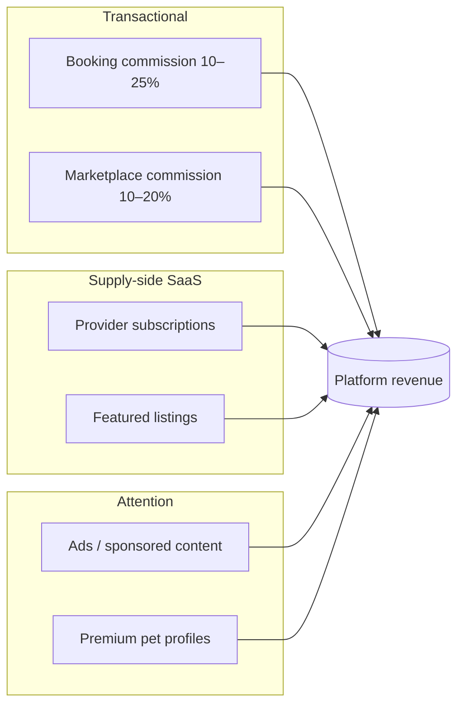
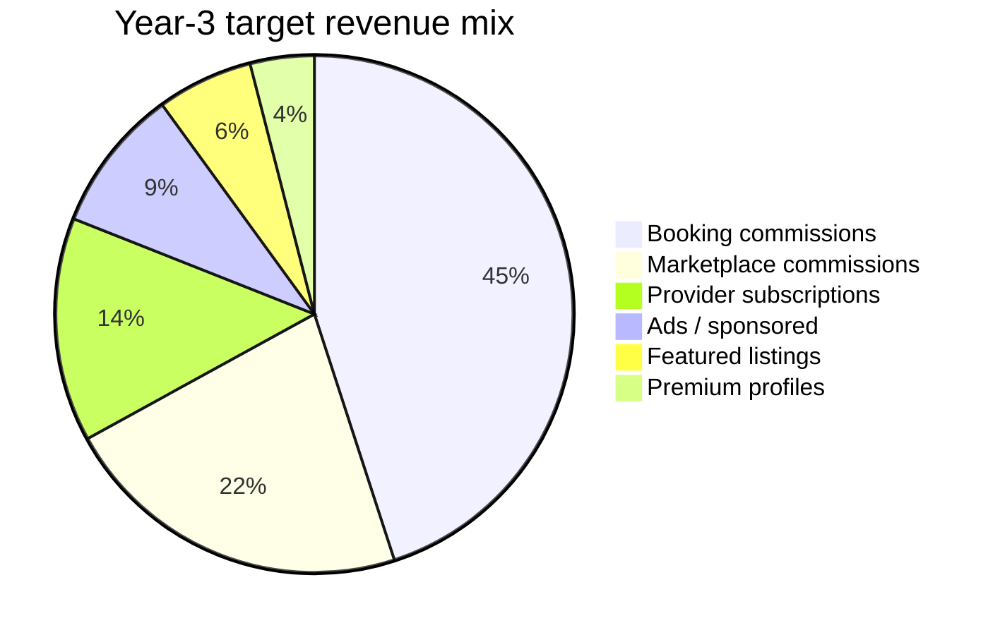

# PETINDER — Monetization Strategy

> Principle: monetize the **transaction first** (commission), the **supply side second** (subscriptions, featured listings), attention **last** (ads). Never let take rate strangle early liquidity.

---

## 1. Revenue Streams Overview

---

## 2. Commission per Booking (10–25%)

Commission is snapshotted on each booking/order item (`commission_rate` column) so rate changes never apply retroactively. Collected via **Stripe Connect application fees** — the platform never holds provider funds directly.

| Category | Rate | Rationale |
|---|---|---|
| Dog walking | 20% | High frequency, low ticket, platform does discovery + GPS trust layer |
| Pet sitting / boarding | 18% | Higher ticket, multi-day; competitive with Rover (~20%) |
| Grooming | 15% | Providers have existing clientele; lower rate wins supply |
| Vet visits / telehealth | 10% | Regulated, high-trust category; low rate to onboard vets |
| Training | 18% | High LTV, repeat packages |
| Marketplace — food & consumables | 10% | Thin margins, repeat purchase driver |
| Marketplace — toys & accessories | 18% | Healthy margins |
| Marketplace — health products | 15% | |
| Adoption | 0% (donation prompt) | Trust + brand; monetized indirectly via new-owner starter funnel |

**Mechanics**
- Owner pays list price + small service fee (3–5%) at checkout; provider-side commission deducted from payout. Both sides see a transparent breakdown.
- New-provider promo: first 10 bookings at 10% to seed supply in new cities.
- Volume tiering at scale: providers above $5k/quarter GMV drop 2 points (retention lever against off-platform leakage).

## 3. Featured Listings

| Product | Placement | Price (indicative) |
|---|---|---|
| Featured provider | Top of category/geo search results, "Featured" badge | $19–49/wk by metro size |
| Featured product | Marketplace category top row | $9–29/wk |
| Map pin boost | Highlighted pin in services map | $9/wk |

Rules: max 2 featured slots per result page, always labeled, never above a higher-rated organic result by more than 2 positions (protects marketplace trust). Stored via `provider_profiles.featured_until`.

## 4. Provider Subscriptions

| | **Free** | **Pro — $19/mo** | **Elite — $49/mo** |
|---|---|---|---|
| Listings | 3 services | Unlimited | Unlimited |
| Commission | Standard | −2 pts | −4 pts |
| Calendar tools | Basic | Recurring slots, sync | + multi-staff calendar |
| Placement | Organic | Search boost | Search boost + 1 featured week/mo |
| Payouts | Weekly | Weekly | Instant payouts |
| Analytics | — | Profile views, conversion | + demand heatmaps, pricing tips |
| AI tools | — | Chat suggested replies | + auto-replies, review responder |
| Badge | — | Pro | Elite |
| Storefront (shops) | 10 SKUs | 100 SKUs | Unlimited + promotions engine |

Subscription discount on commission is deliberate: it converts variable take into predictable SaaS revenue from power providers, and reduces their incentive to take clients off-platform.

## 5. Ads & Sponsored Content

- **Sponsored feed posts** (`posts.is_sponsored = true`): pet brands (food, insurance, toys) buy native posts; frequency cap 1 in 8 feed items, always labeled "Sponsored".
- **Sponsored search**: keyword/category bids in marketplace search (Phase 3).
- **Brand partnerships**: breed/lifecycle targeting (e.g. puppy owners → insurance, senior dogs → joint supplements) using first-party data only; no third-party data sale.
- Guardrail: ads launch only after DAU > 100k and feed health metrics are stable; veterinary/medical ad claims require manual review.

## 6. Premium Pet Profiles — $4.99/mo or $39/yr

| Feature | Free | Premium |
|---|---|---|
| Photos per pet | 6 | Unlimited + video |
| Match | Standard queue | Priority in candidate decks, see who liked your pet |
| Profile | Standard | Custom themes, verified-pet badge, pet "résumé" PDF (vaccines, vet records) for sitters/boarding |
| Health | — | Vaccine & medication reminders, vet record vault |
| Social | — | Profile visitor insights |

Positioning: emotional spend ("spoil your pet") with practical hooks (records vault is genuinely useful for boarding/travel).

---

## 7. Projected Revenue Mix

| Stream | MVP (yr 1) | Growth (yr 2) | Scale (yr 3+) |
|---|---|---|---|
| Booking commissions | 80% | 55% | 45% |
| Marketplace commissions | 5% | 18% | 22% |
| Provider subscriptions | 8% | 14% | 14% |
| Featured listings | 5% | 7% | 6% |
| Ads / sponsored | 0% | 3% | 9% |
| Premium pet profiles | 2% | 3% | 4% |

Illustrative scale math: at $2M monthly GMV with a 16% blended take rate → ~$320k/mo transactional revenue; subscriptions and ads layer on roughly 35–45% on top of that.

---

## 8. Guardrails: Take Rate vs Liquidity

The core tension: every point of take rate pushes providers toward off-platform transactions and starves liquidity; every point given away delays profitability.

| Guardrail | Rule |
|---|---|
| Liquidity first | In any new city, do **not** raise commissions or sell featured listings until fill rate (booking requests fulfilled < 24h) > 70% and search→booking conversion > 8% |
| Take-rate ceiling | Blended take rate capped at 25% all-in (commission + owner service fee); monitor provider churn vs rate cohorts quarterly |
| Disintermediation defense | Value providers can't replicate: GPS-tracked trust layer, insurance coverage on platform bookings, payment protection, dispute resolution, rebooking demand. Detect off-platform leakage (phone/email regex in chat → soft warning, repeat → review) |
| Featured-listing integrity | Paid placement never outranks safety: unverified or sub-4.0-rated providers cannot buy featured slots |
| Ads ceiling | Ad load capped at 12.5% of feed; pause ads in any cohort where session length drops > 10% after ad introduction |
| Subscription fairness | Free tier must remain viable for a part-time walker (3 listings, weekly payouts) — supply breadth beats short-term ARPU |
| Pricing transparency | Full fee breakdown shown to both sides at checkout; no hidden fees (top driver of marketplace distrust and chargebacks) |
| Metric watchlist | North star: completed bookings/week. Guard metrics: fill rate, provider 90-day retention, dispute rate < 1.5%, NPS both sides |

**Sequencing summary:** Year 1 — commission only, underpriced, win liquidity. Year 2 — introduce subscriptions + featured listings to power sellers, open marketplace. Year 3 — ads and premium layers once the network is the moat.

---

## 9. Pricing Experiments & Instrumentation

| Experiment | Hypothesis | Primary metric | Kill criterion |
|---|---|---|---|
| Owner service fee 3% vs 5% | 5% has negligible checkout drop-off | Checkout conversion | > 1.5 pt conversion drop |
| Walking commission 18% vs 22% | Supply churn is flat below 22% | Provider 90-day retention | Retention −5% in test cohort |
| Pro tier $19 vs $29 | Power providers are price-insensitive up to $29 | Sub attach rate among >10 bookings/mo | Attach < 60% of control |
| First-10-bookings promo (10%) | Promo lifts new-city activation | Time-to-first-booking per provider | No lift after 2 cities |
| Featured listing weekly vs CPC | Flat weekly is simpler and converts better | Featured revenue / churn | CPC outperforms by > 20% |

Instrumentation requirements: every checkout records the commission rate snapshot (already in schema), experiment cohort id on `bookings`/`orders` metadata, and weekly take-rate-by-category dashboards from the `commissions` table.

## 10. Risks & Mitigations

| Risk | Mitigation |
|---|---|
| Off-platform leakage (walker + owner go direct) | Insurance + payment protection only on platform bookings; rebooking shortcuts; loyalty pricing for repeat pairs; chat leakage detection |
| Race-to-the-bottom on commission vs competitors | Compete on trust stack (verification, GPS, disputes) rather than rate; keep vet category deliberately cheap as an acquisition wedge |
| Ads degrading the social feed | Hard frequency cap, native format only, session-length guard metric with auto-pause |
| Subscription cannibalizing commission | Commission discount capped at −4 pts; model breakeven: Elite pays for itself above ~$1.2k/mo provider GMV |
| Regulatory (worker classification for walkers/sitters) | Providers are independent marketplace sellers: they set prices, schedules, and accept/decline freely; no exclusivity |
| Chargebacks on high-ticket boarding | Clear cancellation policy at checkout, 48h escrow, GPS/photo evidence trail reduces "service not rendered" disputes |
