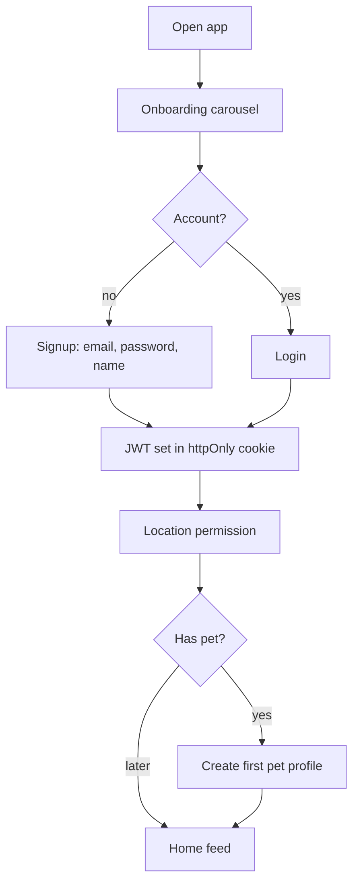
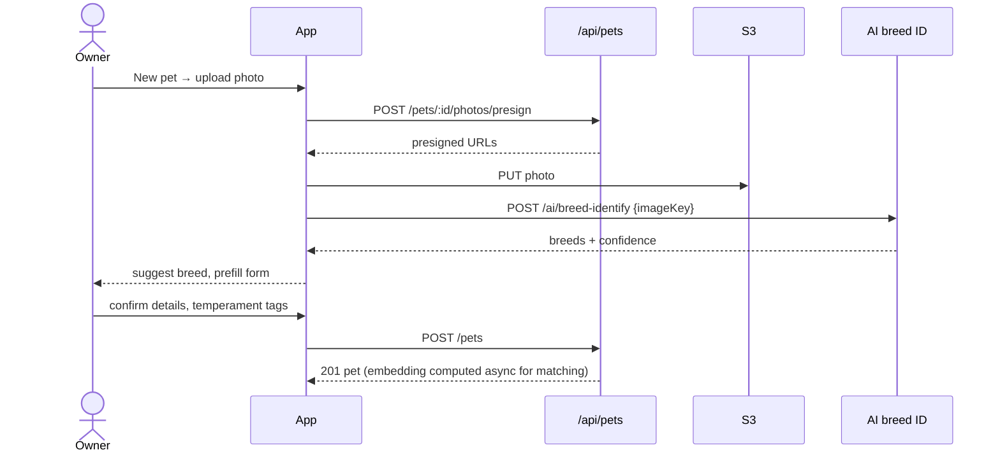
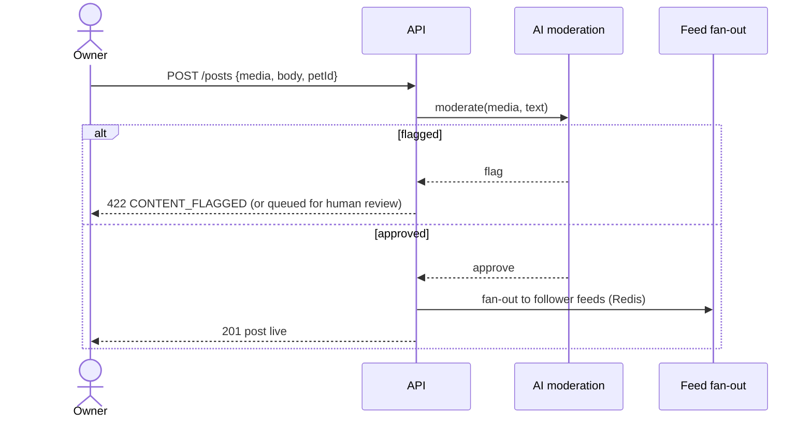
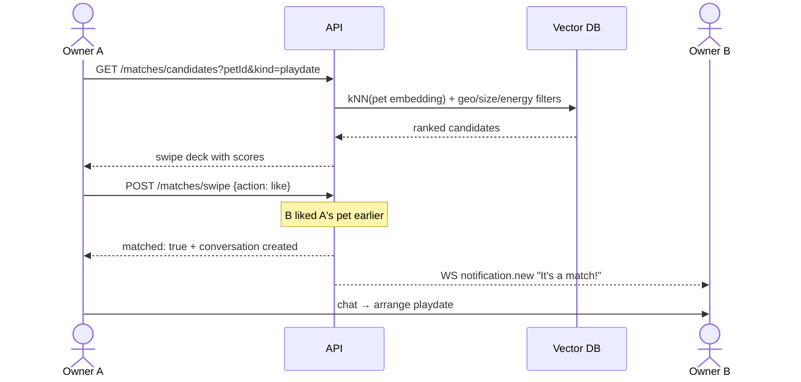
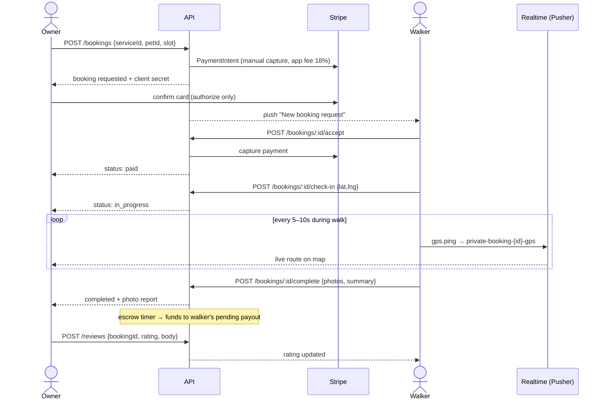
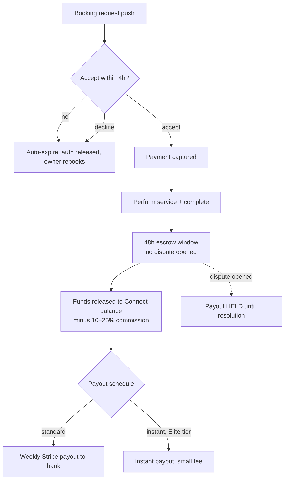
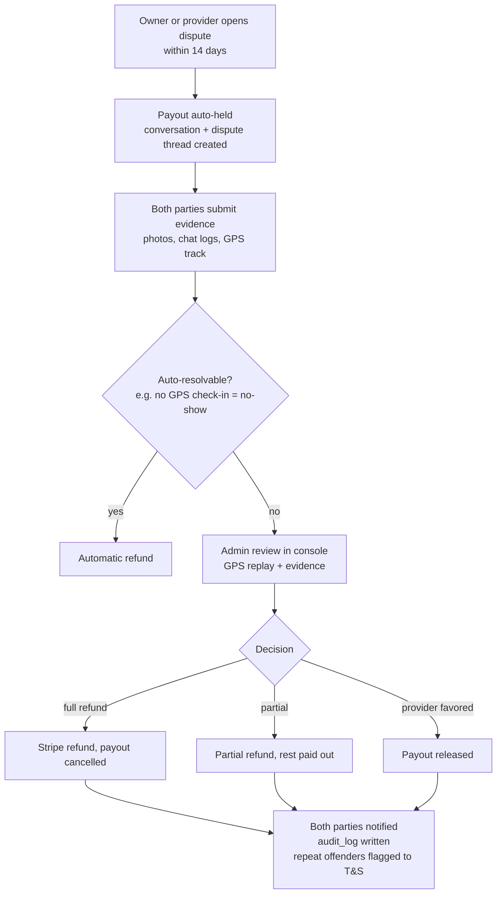
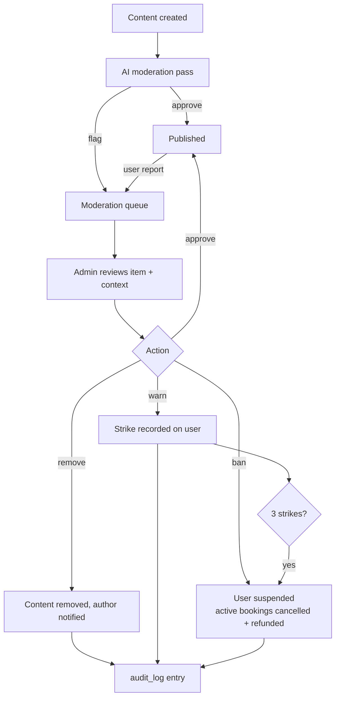

# PETINDER — Screens & User Flows

> Mobile-first. MVP ships as a responsive Next.js PWA; Phase 2 moves owner/provider apps to React Native (Expo). Admin stays web-only.

---

## 1. Screen Inventory

### 1.1 Owner App (mobile)

| # | Screen | Key elements | Route (MVP) |
|---|---|---|---|
| O1 | Splash / Onboarding carousel | Value props, location permission, signup/login CTA | `/welcome` |
| O2 | Signup / Login | Email+password, role choice hidden (owner default) | `/signup`, `/login` |
| O3 | Home (Feed) | Tabbed feed (Following / Discover), stories-style pet highlights, FAB to post | `/` |
| O4 | Post composer | Photo/video picker, pet tag, caption, visibility | `/posts/new` |
| O5 | Post detail | Media, likes, threaded comments, report | `/posts/[id]` |
| O6 | Pet profile (own) | Photos, breed, vaccination, temperament tags, premium badge, edit | `/pets/[id]` |
| O7 | Create/edit pet | Form + AI breed suggestion from first photo | `/pets/new` |
| O8 | Match (Playdate/Adoption) | Swipe deck, compatibility score, filters (distance, size, energy) | `/match` |
| O9 | Match success modal | "It's a match!" → open chat | overlay |
| O10 | Explore services | Map + list of nearby providers, category chips, search | `/services` |
| O11 | Provider detail | Bio, services, rating, reviews, verified/background-check badges, calendar | `/providers/[id]` |
| O12 | Booking checkout | Slot picker, pet selector, price + fees breakdown, pay | `/bookings/new` |
| O13 | Booking detail / live walk | Status timeline, **live GPS map**, chat shortcut, complete/review CTA | `/bookings/[id]` |
| O14 | Marketplace | Product grid, categories, search, cart icon | `/shop` |
| O15 | Product detail | Gallery, vendor, reviews, add to cart | `/shop/[id]` |
| O16 | Cart & checkout | Items by vendor, wallet credit toggle, Stripe payment sheet | `/cart` |
| O17 | Orders | Order list + tracking states | `/orders` |
| O18 | Chat inbox / thread | Conversations, typing indicator, attachments | `/messages` |
| O19 | Notifications | Grouped by kind, deep links | `/notifications` |
| O20 | Wallet | Balance, transaction ledger | `/wallet` |
| O21 | Profile & settings | Account, pets list, premium upsell, dispute center, logout | `/profile` |
| O22 | Leave review | Stars + text post-completion | modal |
| O23 | Dispute wizard | Reason → description → evidence upload → submit | `/disputes/new` |

### 1.2 Provider App (mobile)

| # | Screen | Key elements |
|---|---|---|
| P1 | Provider onboarding wizard | Business info → type (walker/sitter/vet/groomer/shop) → ID verification (Persona) → background check consent → Stripe Connect onboarding |
| P2 | Dashboard | Today's bookings, earnings snapshot, rating, verification status banner |
| P3 | Service catalog | CRUD services, pricing, duration, radius |
| P4 | Availability calendar | Week view, recurring slots, blackout dates |
| P5 | Booking requests | Accept/decline with countdown (auto-expire) |
| P6 | Active booking / walk mode | Check-in button, GPS auto-track, photo updates to owner, complete |
| P7 | Earnings & payouts | Pending vs paid, commission breakdown, payout schedule, Stripe dashboard link |
| P8 | Storefront (shop type) | Product CRUD, inventory, order fulfillment queue |
| P9 | Chat inbox | With AI suggested replies |
| P10 | Reviews & reputation | Rating trend, badges, respond to reviews |
| P11 | Subscription & growth | Tier upgrade (Free/Pro/Elite), featured listing purchase |
| P12 | Disputes | Respond with evidence |

### 1.3 Admin Dashboard (web)

| # | Screen | Key elements |
|---|---|---|
| A1 | Overview | GMV, take rate, bookings, fill rate (liquidity), DAU, dispute rate |
| A2 | Users & providers | Search, suspend/reinstate, role audit |
| A3 | Verification queue | Pending ID/background checks, vendor webhook results, pass/fail |
| A4 | Moderation queue | AI-flagged + reported posts/comments/reviews; approve/remove/warn/ban |
| A5 | Disputes console | Timeline, evidence (incl. GPS track replay), resolve refund/partial/provider |
| A6 | Payments ops | Payments, refunds, payout holds/releases |
| A7 | Marketplace ops | Vendor approvals, category & commission config (10–25%) |
| A8 | Audit log explorer | Filter by actor/action/target |

---

## 2. User Flows

### 2.1 Onboarding (owner)



### 2.2 Create Pet Profile



### 2.3 Post to Feed



### 2.4 Playdate Match



### 2.5 Book a Dog Walker (GPS tracking, completion, review)



### 2.6 Marketplace Checkout (Stripe commission split)

```mermaid
sequenceDiagram
    actor O as Owner
    participant API
    participant INV as Inventory
    participant ST as Stripe Connect

    O->>API: POST /orders (from cart)
    API->>INV: reserve stock (15-min TTL)
    API->>ST: PaymentIntent, destination charges per vendor,<br/>application_fee = commission (e.g. 15%)
    API-->>O: client secret
    O->>ST: pay
    ST->>API: webhook payment_intent.succeeded
    API->>INV: commit stock
    API-->>O: order paid
    Note over ST: net amount lands in vendor's<br/>Connect balance; platform keeps fee
    API-->>O: vendor fulfills → fulfilled → delivered → review prompt
```

### 2.7 Provider Accepts Booking & Gets Paid Out



### 2.8 Dispute Flow



### 2.9 Admin Moderation



---

## 3. Navigation Model (MVP PWA)

- **Owner bottom tabs:** Feed · Match · Services · Shop · Profile (chat + notifications in header).
- **Provider bottom tabs:** Dashboard · Bookings · Calendar · Earnings · Profile.
- **Admin:** left-nav web layout (Overview, Users, Verifications, Moderation, Disputes, Payments, Marketplace, Audit).
- Role is read from the JWT; `middleware.ts` redirects `/admin/*` for non-admins and provider routes for non-providers.
